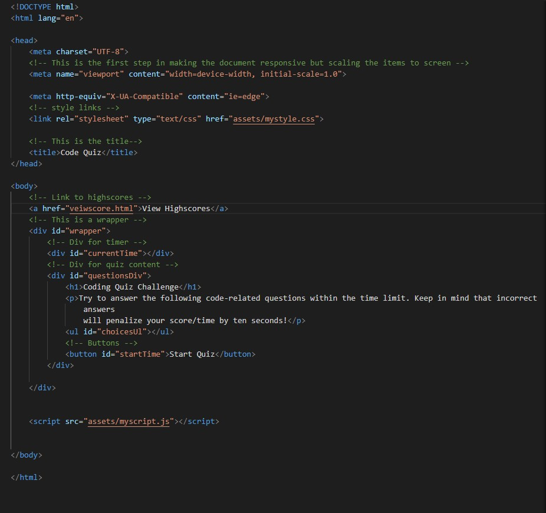
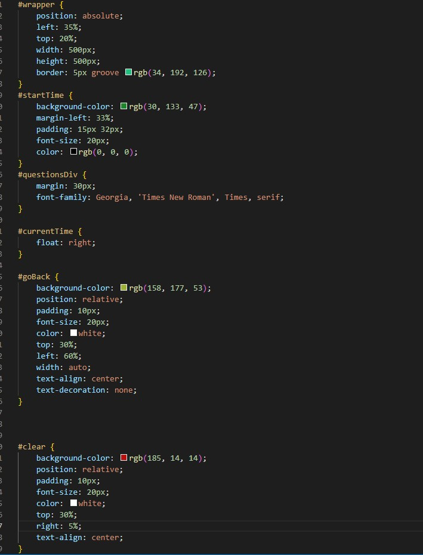
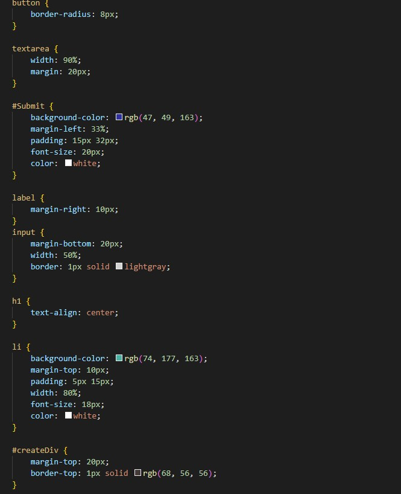
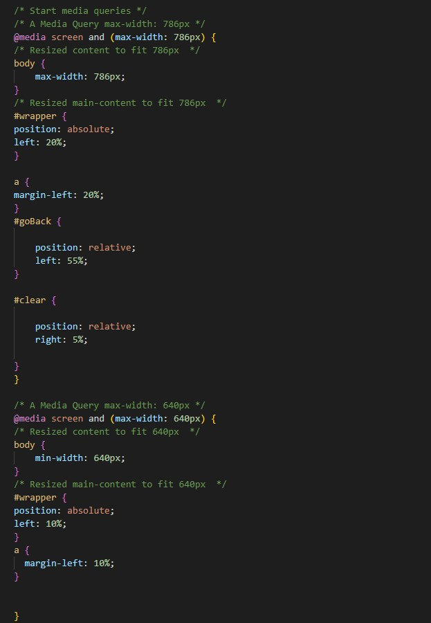

# Welcome to the test!
```
The goal was just to create a quiz with multiple-choice questions. Making sure the timer countes down gets doc time when anwser wrong and keeps track of your score at the end. 
```
#
## User Story
```
AS A coding boot camp student
I WANT to take a timed quiz on JavaScript fundamentals that stores high scores
SO THAT I can gauge my progress compared to my peers
```
## Acceptance Criteria
```
GIVEN I am taking a code quiz
WHEN I click the start button
THEN a timer starts and I am presented with a question
WHEN I answer a question
THEN I am presented with another question
WHEN I answer a question incorrectly
THEN time is subtracted from the clock
WHEN all questions are answered or the timer reaches 0
THEN the game is over
WHEN the game is over
THEN I can save my initials and score
```
 #
 ## My Process
```
I started off by makeing  HTML files, one is for the main Quiz page. 
```


```
I also made an HTML to have for the scores when you click on the link
```

```
Next I moved on to making some code for the CSS file this contains both CSS for the HTML Shown above.
```



```
Our site now look Better
```


```
Nows lets go make a JS file to get this site working!
```


